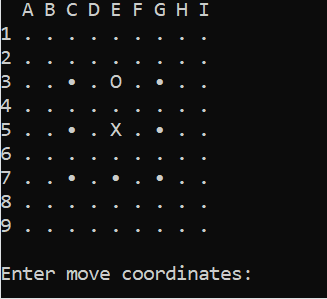

# BadukDeepLearningModel

## Overview
This is a simple deep learning model that learns to play the game of go.
I am working on 9 by 9 boards because of hardware and time limits. Also 9 by 9 is a much simpler problem compared to 19 by 19 for a model to learn so it is a good way to pracitce deep learning.

- data/create_dataset.py creates the torch data file from a folder of sgf files
You can find a lot of sgfs files for small board sizes at https://www.eugeneweb.com/pipermail/computer-go/2015-December/008353.html
- train.py trains the model and has a simple hyper parameter search system implemented.
- versus.py is a simple terminal program to play against the model you trained.

If you just wanna play against the model you can run the versus.py directly. The weights I've trained are in the repo checkpoints/mw_256ns_4ls_0.001lr_100ep_256bs.pth and the versus.py points to that weights atm.

```bash
    git clone https://github.com/yourusername/BadukDeepLearningModel.git
    cd BadukDeepLearningModel
    pip install -r requirements.txt
    python3 versus.py
 ```


## Demo

Here's a quick demo of playing against a trained model in action:




## To-Do List

- [ ] Use Ray Tune and/or Optuna for hyper parameter search.
- [ ] Add convolutions to the model.
- [ ] Improve versus.py.
- [ ] Improve logging and plotting.
